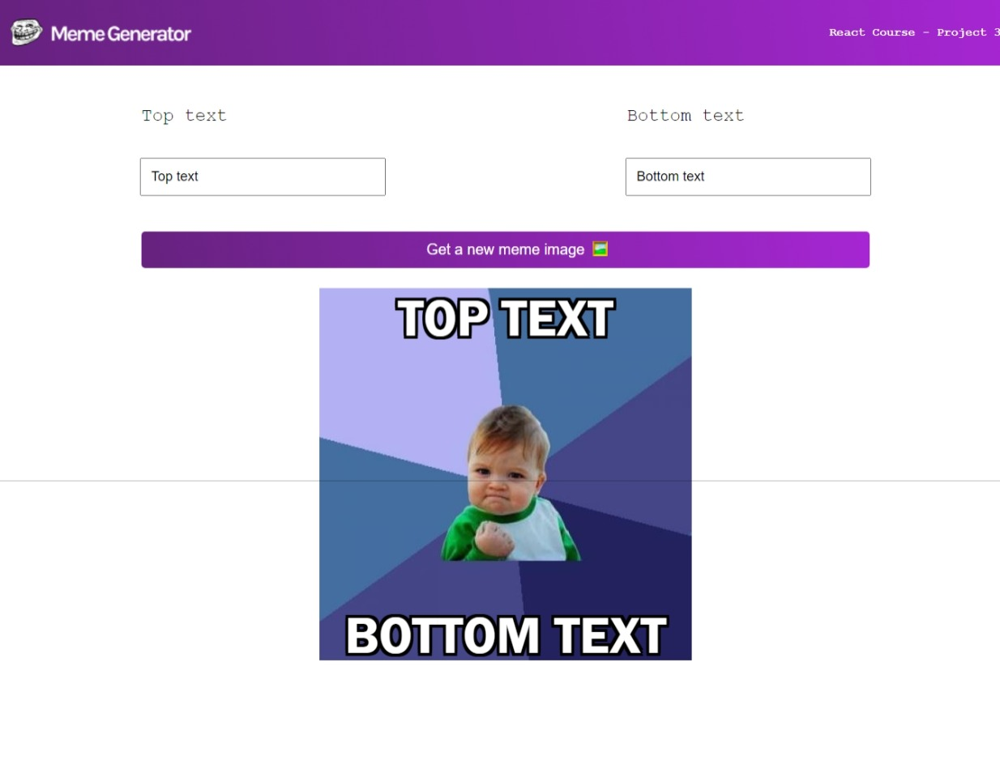

Quick start:

## Development

Run Webpack in watch-mode to continually compile the JavaScript as you work:

```
npm run watch

```

you can to use https://github.com/ritwickdey/vscode-live-server-plus-plus for launch or view this project later Run Webpack (npm run watch).





